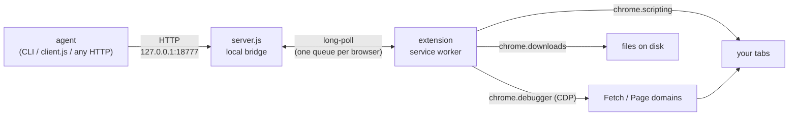
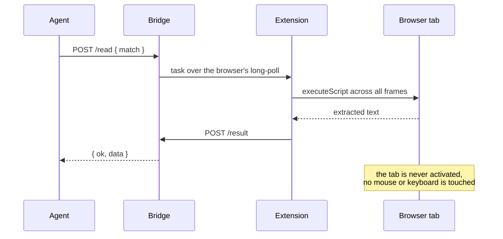
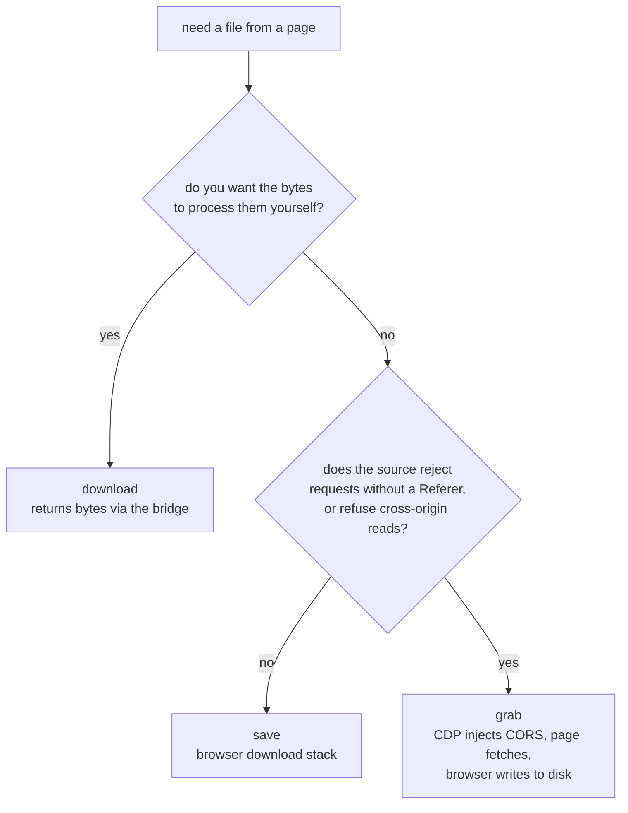

# Agent Browser Bridge

**Let a local agent drive the browser you already have open — in the background, without stealing
focus.**

A browser extension plus a small local server. An agent gets to read pages, click, type, wait, take
screenshots and save files — on your real, already-logged-in session, on any tab, **including
background tabs**, while you keep working in another window.

[简体中文](README.zh-CN.md) · English

---

## Contents

- [The problem it solves](#the-problem-it-solves)
- [How it works](#how-it-works)
- [What it can do](#what-it-can-do)
- [Requirements](#requirements)
- [Install](#install)
- [Permissions](#permissions)
- [Usage](#usage)
- [Getting files out of a page](#getting-files-out-of-a-page)
- [Finding media on a page](#finding-media-on-a-page)
- [Seeing what the agent is doing](#seeing-what-the-agent-is-doing)
- [Pages that fight back](#pages-that-fight-back)
- [Security model](#security-model)
- [Testing](#testing)
- [Project layout](#project-layout)
- [Limitations](#limitations)
- [License](#license)

---

## The problem it solves

Almost all browser automation starts a **fresh** browser. That means no logins, no cookies, no
extensions, and a window that pops up over whatever you were doing. It falls apart the moment a page
needs SSO — which is most of the pages worth automating.

This project does the opposite. It attaches to the browser that is **already running and already
signed in**, so every page is authenticated before the agent touches it.

It also handles the awkward realities of real sites, which are where naive automation tends to
break: editors that live inside an `iframe`, editors that use `designMode` instead of
`contenteditable`, UI that only mounts when a tab is visible, buttons whose handlers listen for
`mousedown` rather than `click`, tabs the browser has frozen, download links that reject requests
without a `Referer`, and CDNs that refuse cross-origin reads.

## How it works



A command's round trip:



Because work happens through `chrome.scripting.executeScript`, the tab is **never activated**, the
mouse never moves, and no synthetic keystrokes are sent. A background tab works exactly as well as
the one you are looking at — which is the whole point.

## What it can do

| Capability | What it does |
|---|---|
| `read` | Page text; auto-detects the main content region, or a WYSIWYG editor frame |
| `links` | List anchors with index, text and href |
| `click` | Click links, and buttons with **risk-based auto-allowance** |
| `type` | Type into inputs, textareas, `contenteditable` and `designMode` editors |
| `key` | Dispatch key events to in-page handlers |
| `navigate` | Open a URL in a background tab; waits for the navigation to commit |
| `wait` | Wait for an element or text to appear or disappear |
| `eval` | Run JavaScript in the page and return the result |
| `screenshot` | Element, full-page, or background-tab capture |
| `media` | List every media candidate on a page (video, streams, images, audio) |
| `save` | Save a URL to disk through the browser's download stack |
| `grab` | Save media from CDNs that are hotlink-protected *and* refuse CORS |
| `download` | Fetch a URL with the page's login state and hand you the bytes |
| `upload` | Put local files into a file input |
| `session` | Read the tab's cookies and web storage *(opt-in permission)* |
| `tabs` `mark` `unmark` `close` `activate` | Tab management, plus a visible "agent is working here" marker |
| `frames` | Diagnose which frame holds the editor, and how it is editable |
| `diag` | Extension runtime diagnostics: version, polling, restarts, errors |

Chrome and Edge run side by side, fully isolated, with automatic routing.

## Requirements

- Node.js 18+
- Chrome or Edge (Chromium 102+; MV3)

Optional, only for pulling media off sites whose streams are fragmented:

- [`yt-dlp`](https://github.com/yt-dlp/yt-dlp) — handles HLS/DASH and a very long list of sites
- `ffmpeg` — merges the fragments `yt-dlp` downloads

The bridge works fine without them; they are for the download use case.

## Install

**1. Start the bridge**

```bash
node server.js            # listens on 127.0.0.1:18777 only
```

On Windows there are two helper scripts:

```powershell
powershell -NoProfile -ExecutionPolicy Bypass -File .\start-server.ps1
powershell -NoProfile -ExecutionPolicy Bypass -File .\restart-server.ps1   # after editing server.js
```

**2. Load the extension**

- Chrome: `chrome://extensions` → enable **Developer mode** → **Load unpacked** → pick `extension/`
- Edge: `edge://extensions` → enable **Developer mode** → **Load unpacked** → pick `extension/`

**3. Grant site access**

Nothing is authorised by default. Click the extension icon and grant the sites you want it to work
on — one hostname at a time, or all sites. The browser's own permission prompt is what enforces
this, so you stay in control.

## Permissions

The install prompt stays small on purpose. Two things are worth knowing, because Chrome's own rules
decided them for us:

| Permission | State | Why |
|---|---|---|
| `tabs` `scripting` `storage` `alarms` | required | the core: find tabs, inject, keep the connection alive |
| `debugger` | **required** | powers `upload`, CDP screenshots and `grab`. Chrome **forbids** this one being optional — declaring it optional makes Chrome drop it and the install logs an error, so it has to be required |
| `downloads` | **required** | powers `save` and `grab` |
| `cookies` | **optional** | powers `session`. Requested only when you press the button in the popup; until then `session` returns `permission_not_granted` |
| host access (`*://*/*`) | **optional** | granted per site from the popup, never at install time |

If you would rather not hand over `debugger`, delete `upload`, `screenshot` and `grab` — nothing
else depends on it.

## Usage

### CLI

```bash
node read.js tabs
node read.js read  --match "example.com/page"
node read.js links --match "example.com/page"
node read.js click --match "example.com/page" --text "Next page"
node read.js type  --match "example.com/page" --value "hello"
node read.js wait  --match "example.com/page" --selector "#editor"
node read.js navigate --url "https://example.com/other"

# files off a page
node read.js media    --match "example.com/watch"
node read.js save     --url "https://cdn.example.com/pic.jpg" --filename "pic.jpg"
node read.js grab     --match "example.com/watch" --url "<media url>" --filename "clip.mp4"
node read.js download --match "example.com" --url "/export.csv" --out data.csv

# advanced (opt-in permissions apply)
node read.js eval       --match "example.com" --code "document.title"
node read.js screenshot --match "example.com" --out shot.png --selector "table"
node read.js session    --match "example.com" --name SESSION
node read.js upload     --match "example.com" --file /path/to/report.pdf
```

`--dryRun` reports what a click *would* hit without clicking, which is useful in automated flows:

```bash
node read.js click --match "example.com" --selector "#btn" --dryRun
# → { isLink, isButtonLike, destructive, blocked }
```

### Client library

Zero dependencies, no CLI needed:

```js
const { createClient } = require('./client.js');

const ab = createClient();                       // 127.0.0.1:18777
if (!(await ab.isReady())) await ab.waitUntilReady(15000);

const page = await ab.read({ match: 'example.com' });
console.log(page.text);

await ab.click({ match: 'example.com', text: 'Next page' });
await ab.wait({ match: 'example.com', selector: '#loaded' });

const media = await ab.media({ match: 'example.com/watch' });
await ab.grab({ match: 'example.com/watch', url: media.videos[0].src, filename: 'clip.mp4' });
```

Failures throw `BridgeError` with a `code`; an unreachable bridge throws `BridgeUnavailableError`.

### HTTP

Every capability is a plain endpoint, so any language or tool can drive it. Call `/health` first —
it returns `apiVersion` and `capabilities`, which is the contract for forward compatibility.

```
GET  /health                      status, apiVersion, capabilities, connected browsers
GET  /tabs?browser=edge
POST /read /links /click /type /key /navigate /wait /frames
POST /mark /unmark /activate /close /save /grab /media /download
POST /eval /screenshot /session /upload
POST /reload
```

## Getting files out of a page

Three ways, and they fail in completely different places. Picking the wrong one is the usual reason
a download "doesn't work".



| | `download` | `save` | `grab` |
|---|---|---|---|
| Mechanism | `fetch()` inside the page | `chrome.downloads` | CDP-injected CORS + page `fetch` + blob download |
| Sends the page's `Referer` | yes | **no** | yes |
| CORS applies | **yes** | no | bypassed (header injected) |
| Size limit | 20 MB | none | none |
| Bytes travel | through the bridge (base64) | straight to disk | straight to disk |
| Needs a tab | yes | no | yes (and no DevTools on it) |
| Where it lands | the path you give it | download dir + `videos/` | download dir + `videos/` |

`save` and `grab` deliberately share a destination (`<browser download dir>/videos/`), so media
from either path — and from an external downloader pointed at the same folder — ends up together.

**Why `grab` has to exist.** `Referer` is a forbidden header for XHR/fetch *and* for the
`downloads` API, so a script cannot attach it. `declarativeNetRequest` can set it, but does **not**
apply to extension-initiated downloads — all three of these were verified experimentally, and each
one fails in its own way. So `save` inevitably gets a 403 from a hotlink-protected CDN, and
`download` inevitably gets `Failed to fetch` from CORS. `grab` sidesteps both by letting the *page*
make the request (correct `Referer`, for free) while CDP injects `Access-Control-Allow-Origin` into
the response so the page is allowed to read it.

```bash
# absolute URL
node read.js save --url "https://cdn.example.com/clip.mp4" --filename "clip.mp4"

# relative URL — resolved against the matched tab's own URL
node read.js save --match "example.com/gallery" --url "/media/photo-01.jpg"
```

Both wait for the download to finish and report the real on-disk path. Same-name files are renamed
rather than overwritten unless you pass `--overwrite`. One caveat: Chrome may adjust the extension
to match the server's `Content-Type` (a `.md` served as `text/plain` is saved as `.txt`).

## Finding media on a page

`media` is what makes this usable by an agent without hand-written probes. Point it at a page and it
returns every candidate it can find:

- `<video>` / `<audio>` element sources
- HLS/DASH manifests and direct links scraped from the page's own data
- content-sized images (UI icons are filtered out by rendered dimensions)

`blob:` sources are reported as such rather than hidden, because those are in-memory handles — you
have to locate the underlying stream before anything can be downloaded.

```bash
node read.js media --match "example.com/watch"
# → { videos: [...], streams: [...], images: [...], counts: {...} }
```

Typical flow: `media` finds the URL with the browser's session → `grab` saves it. For fragmented
streams, hand the manifest URL to `yt-dlp` instead and let it download and merge the segments.

## Seeing what the agent is doing

Every tab an agent touches is marked, two ways:

- **A dot on the favicon** — the site's icon is redrawn with a coloured dot composited in, and
  written back to every `<link rel="icon">`. The colour tracks the operation: read, click, type,
  navigate.
- **A prefix on the tab title.**

Both clear themselves after a few minutes (the page schedules its own cleanup, so even a frozen
background tab tidies up when you next visit it), and both can be cleared on demand — from the
extension popup, or with `read.js unmark`.

Two details that cost real debugging time, in case you touch this code:

- The favicon link's `type` **must** be updated to `image/png` when swapping in a PNG data URL.
  Leaving it as `image/x-icon` makes the browser fail to decode it and silently fall back to the
  original icon — the DOM looks correct while the tab bar shows nothing.
- A page that rewrites `document.title` (dashboards, SPAs) will drop the title mark, leaving a
  half-mark. Cleanup therefore discovers marked tabs by **either** the title prefix or the tab's
  `favIconUrl`, not the title alone.

## Pages that fight back

Real sites are messier than test pages. These are handled, and each one was added because it broke
something in practice:

| Situation | Handling |
|---|---|
| **WYSIWYG editor in an `iframe`** | injections run across all frames and pick the best result by score (requested selector > editable frame > most text) |
| **Editor using `designMode`** | `designMode` is detected and the frame's body used as the target, since no element carries `contenteditable` |
| **Editor only mounts when visible** | reported honestly; `activate` brings the tab forward to wake it |
| **Buttons bound to `mousedown`** | a full pointer/mouse event sequence is dispatched, not just `.click()` |
| **Frozen background tab** | every injection is wrapped in a timeout, so it fails fast with `tab_unresponsive` instead of hanging the task |
| **Site checks `Referer` / blocks CORS** | `grab` (see above) |
| **Chrome and Edge both open** | one queue per browser; the extension rejects tasks addressed elsewhere; unspecified requests try each browser until the tab is found |

## Security model

- Binds to `127.0.0.1` only. No LAN or internet exposure.
- Validates the `Origin` header and rejects requests from ordinary web pages, so a malicious site
  cannot drive the extension by CSRF.
- Site access is **denied by default**, enforced by the browser's permission system. The install
  manifest requests no host permissions beyond the local bridge.
- Privileged capabilities are separated: `cookies` is opt-in and off until granted from the popup;
  `debugger`-backed actions are declared required only because Chrome forbids the alternative.
- Read operations have no side effects. Write operations are risk-classified, and the caller is told
  what was actually clicked or typed.
- No telemetry and no external network calls. The only outbound requests are the ones *you* ask for:
  `download` fetches the URL you pass with the tab's login state, `grab` fetches the media URL you
  pass, `eval` runs the code you pass.
- `type` with `method: 'html'` sanitises its input: strips `script`/`iframe`/`style`, `on*` handlers
  and `javascript:` URLs.
- `grab` injects a permissive CORS header for one CDN origin, for the duration of that single call.
  The interception is scoped to that origin, every other request passes through untouched, and the
  debugger is detached as soon as the call ends.

Because `eval`, `session` and `download` are powerful primitives, treat anything that can reach the
local bridge — any local process — as able to use them once granted. Keep port 18777 on loopback.

## Testing

```bash
cp test-config.example.js test-config.js   # then edit it

node test-basic.js          # 33 assertions: reads, writes, routing, errors
node test-multibrowser.js   # 12 assertions: Chrome/Edge isolation (needs both)
node test-interaction.js    # 10 assertions: click classification + wait (dry-run only)
node test-editor.js         # WYSIWYG editor path (enters edit mode; creates a draft)
```

Tests operate on a page you configure, create and close their own tabs, and leave your active tab
untouched.

> `test-editor.js` enters the page's edit mode, which makes the site auto-save a draft. Point it at
> a scratch page, not production content.

There is also a small static check that guards a mistake this project made once and that is hard to
spot in review: a function injected into a page only carries its own source, so referencing a
module-level helper compiles fine and then throws at runtime.

```bash
node ../utils/check-inject-scope.js
```

## Project layout

```
extension/               MV3 extension (Chrome + Edge)
  background.js          service worker: polling, actions, page-injected functions
  popup.html/.js         status, site grants, opt-in permissions, clear marks
server.js                local bridge (no dependencies)
client.js                reusable client library
read.js                  CLI wrapper around client.js
test-*.js                test suites
start-server.ps1         Windows helpers
restart-server.ps1
```

## Limitations

- The browser must be running with the extension enabled.
- A page must have been loaded at least once; never-rendered content cannot be read.
- `key` dispatches synthetic events — they trigger in-page handlers but do not produce text and
  cannot trigger browser-level shortcuts. Use `type` for text.
- Editing UIs that only mount when the tab is visible need the tab foregrounded once.
- **Streams whose source is a `blob:` URL cannot be saved directly.** Those are in-memory handles,
  not fetchable addresses. If the page builds them from a manifest, `media` will usually surface
  that manifest, and the manifest can be downloaded instead.
- **DRM-protected content is out of scope.** Decryption keys for those live behind a licence server
  and hardware secure path; obtaining them means defeating the protection itself, which this project
  does not do.
- Not affiliated with any browser vendor; uses only documented extension APIs.

## License

MIT — see [LICENSE](LICENSE).
