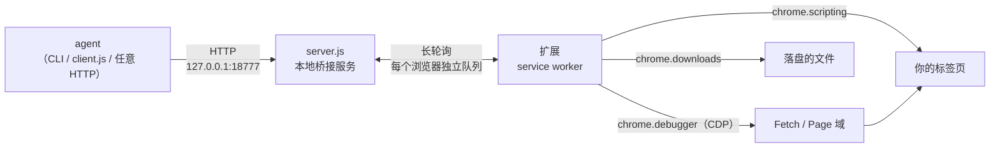
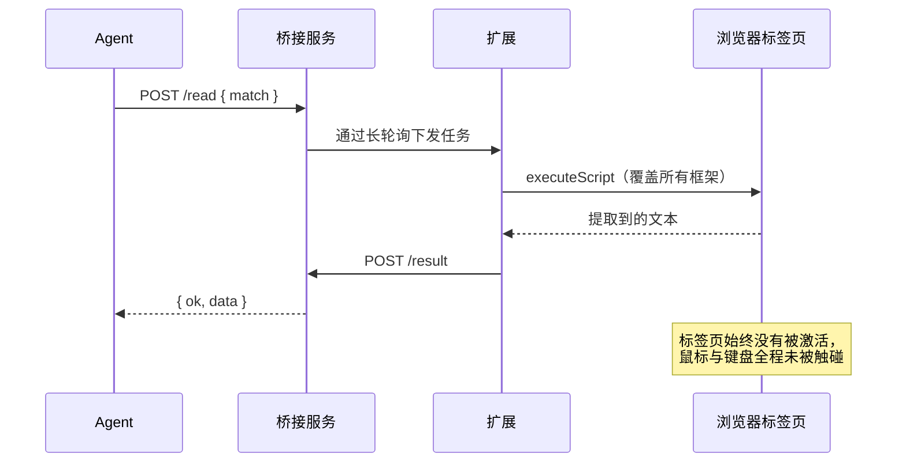
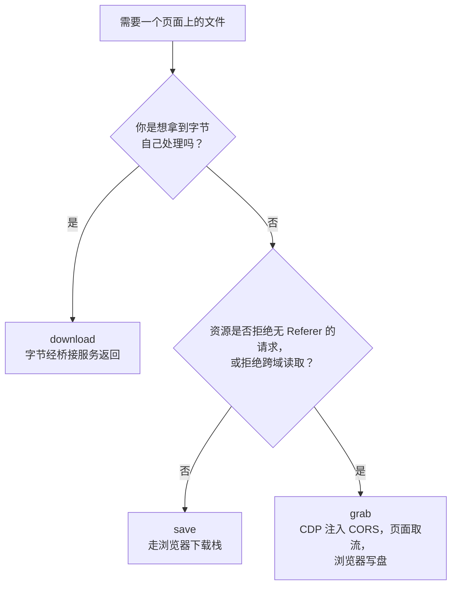

# Agent Browser Bridge

**让本机 AI agent 操控你已经打开的那个浏览器 —— 完全后台运行，不抢焦点。**

一个浏览器扩展加一个本地小服务。agent 能读页面、点击、输入、等待、截图、存文件，用的都是你
**真实且已登录**的会话；任意标签页都能操作，**包括后台标签页**，而你可以在别的窗口照常干活。

简体中文 · [English](README.md)

---

## 目录

- [它解决什么问题](#它解决什么问题)
- [工作原理](#工作原理)
- [能做什么](#能做什么)
- [环境要求](#环境要求)
- [安装](#安装)
- [权限模型](#权限模型)
- [用法](#用法)
- [把文件从页面里取出来](#把文件从页面里取出来)
- [发现页面里的媒体](#发现页面里的媒体)
- [看到 agent 正在做什么](#看到-agent-正在做什么)
- [难缠的页面](#难缠的页面)
- [安全模型](#安全模型)
- [测试](#测试)
- [项目结构](#项目结构)
- [已知限制](#已知限制)
- [许可](#许可)

---

## 它解决什么问题

几乎所有浏览器自动化都是**新开一个浏览器**：没有登录态、没有 Cookie、没有扩展，还会弹出一个
窗口盖住你正在做的事。一旦页面需要 SSO 就彻底失效 —— 而值得自动化的页面大多都需要 SSO。

这个项目反着来：它挂到**已经在运行、已经登录**的浏览器上，所以 agent 动手之前，每个页面就已经
是登录态。

它也处理真实网站的麻烦之处 —— 这些正是朴素自动化最容易翻车的地方：编辑器藏在 `iframe` 里、
编辑器用 `designMode` 而不是 `contenteditable`、UI 只在标签页可见时才渲染、按钮监听的是
`mousedown` 而不是 `click`、标签页被浏览器冻结、下载链接拒绝没有 `Referer` 的请求、
CDN 拒绝跨域读取。

## 工作原理



一条指令的完整往返：



因为一切通过 `chrome.scripting.executeScript` 完成，标签页**永远不会被激活**，鼠标不会移动，
也不会发送任何模拟按键。后台标签页和你正在看的那个一样好用 —— 这正是关键所在。

## 能做什么

| 能力 | 说明 |
|---|---|
| `read` | 读取正文；自动识别主内容区，或富文本编辑器所在的框架 |
| `links` | 列出链接（含序号、文字、地址） |
| `click` | 点击链接，以及带**风险分级**的按钮 |
| `type` | 写入输入框、文本域、`contenteditable` 与 `designMode` 编辑器 |
| `key` | 向页面内处理器派发按键事件 |
| `navigate` | 在后台标签页打开地址；等待导航真正提交 |
| `wait` | 等待元素或文字出现 / 消失 |
| `eval` | 在页面里执行 JavaScript 并取回结果 |
| `screenshot` | 元素、整页或后台标签页截图 |
| `media` | 列出页面里所有媒体候选（视频、流清单、图片、音频） |
| `save` | 走浏览器下载栈把地址保存到磁盘 |
| `grab` | 保存那些「有防盗链 **且** 拒绝跨域」的 CDN 上的媒体 |
| `download` | 带页面登录态取回地址内容，把字节交给你 |
| `upload` | 把本地文件填进文件选择框 |
| `session` | 读取标签页的 Cookie 与站点存储（**可选权限**） |
| `tabs` `mark` `unmark` `close` `activate` | 标签页管理，以及「agent 正在操作」的可见标记 |
| `frames` | 诊断编辑器在哪个框架、以何种方式可编辑 |
| `diag` | 扩展运行诊断：版本、轮询、重启次数、错误日志 |

Chrome 与 Edge 可同时使用，彼此完全隔离，且自动选路。

## 环境要求

- Node.js 18+
- Chrome 或 Edge（Chromium 102+；MV3）

以下可选，仅在需要下载分片流媒体时使用：

- [`yt-dlp`](https://github.com/yt-dlp/yt-dlp) —— 处理 HLS/DASH，支持站点极多
- `ffmpeg` —— 合并 `yt-dlp` 下载的分片

不用它们，桥接服务本身照常工作。

## 安装

**1. 启动桥接服务**

```bash
node server.js            # 只监听 127.0.0.1:18777
```

Windows 下有两个辅助脚本：

```powershell
powershell -NoProfile -ExecutionPolicy Bypass -File .\start-server.ps1
powershell -NoProfile -ExecutionPolicy Bypass -File .\restart-server.ps1   # 改完 server.js 后重启
```

**2. 加载扩展**

- Chrome：`chrome://extensions` → 开启**开发人员模式** → **加载已解压的扩展程序** → 选 `extension/`
- Edge：`edge://extensions` → 开启**开发人员模式** → **加载解压缩的扩展** → 选 `extension/`

**3. 授予站点权限**

默认不授权任何站点。点扩展图标，逐个授权你要它操作的站点，或一次性授权全部。权限由浏览器
自身的提示框确认，控制权在你手上。

## 权限模型

安装时的索取刻意保持最小。有两件事值得说明 —— 它们是 Chrome 的规则决定的，不是我们的选择：

| 权限 | 状态 | 用途与原因 |
|---|---|---|
| `tabs` `scripting` `storage` `alarms` | 必需 | 核心能力：找标签页、注入脚本、维持连接 |
| `debugger` | **必需** | 支撑 `upload`、CDP 截图与 `grab`。Chrome **禁止**它作为可选权限 —— 写成可选会被直接丢弃并在扩展页报错，所以只能是必需 |
| `downloads` | **必需** | 支撑 `save` 与 `grab` |
| `cookies` | **可选** | 支撑 `session`。只有你在弹窗里点「授予」才会申请；在此之前 `session` 返回 `permission_not_granted` |
| 站点访问（`*://*/*`） | **可选** | 由弹窗逐站授予，安装时绝不索取 |

如果你不想把 `debugger` 交出去，删掉 `upload`、`screenshot`、`grab` 三个动作即可 —— 其他功能
不依赖它。

## 用法

### 命令行

```bash
node read.js tabs
node read.js read  --match "example.com/page"
node read.js links --match "example.com/page"
node read.js click --match "example.com/page" --text "下一页"
node read.js type  --match "example.com/page" --value "hello"
node read.js wait  --match "example.com/page" --selector "#editor"
node read.js navigate --url "https://example.com/other"

# 从页面取文件
node read.js media    --match "example.com/watch"
node read.js save     --url "https://cdn.example.com/pic.jpg" --filename "pic.jpg"
node read.js grab     --match "example.com/watch" --url "<媒体地址>" --filename "clip.mp4"
node read.js download --match "example.com" --url "/export.csv" --out data.csv

# 高级能力（适用前述可选权限）
node read.js eval       --match "example.com" --code "document.title"
node read.js screenshot --match "example.com" --out shot.png --selector "table"
node read.js session    --match "example.com" --name SESSION
node read.js upload     --match "example.com" --file /path/to/report.pdf
```

`--dryRun` 只回报「点击会命中什么」而不真的点，适合自动化流程里先探测：

```bash
node read.js click --match "example.com" --selector "#btn" --dryRun
# → { isLink, isButtonLike, destructive, blocked }
```

### 客户端库

零依赖，不必经过命令行：

```js
const { createClient } = require('./client.js');

const ab = createClient();                       // 127.0.0.1:18777
if (!(await ab.isReady())) await ab.waitUntilReady(15000);

const page = await ab.read({ match: 'example.com' });
console.log(page.text);

await ab.click({ match: 'example.com', text: '下一页' });
await ab.wait({ match: 'example.com', selector: '#loaded' });

const media = await ab.media({ match: 'example.com/watch' });
await ab.grab({ match: 'example.com/watch', url: media.videos[0].src, filename: 'clip.mp4' });
```

失败时抛出 `BridgeError`，用 `err.code` 判断原因；服务未启动则抛 `BridgeUnavailableError`。

### HTTP 接口

每个能力都是普通接口，任何语言或工具都能驱动。建议先读 `/health` —— 它返回 `apiVersion` 与
`capabilities`，这是向前兼容的契约。

```
GET  /health                      状态、apiVersion、能力清单、在线浏览器
GET  /tabs?browser=edge
POST /read /links /click /type /key /navigate /wait /frames
POST /mark /unmark /activate /close /save /grab /media /download
POST /eval /screenshot /session /upload
POST /reload
```

## 把文件从页面里取出来

三种方式，失败的地方完全不同。选错方式，是「下载不好使」最常见的原因。



| | `download` | `save` | `grab` |
|---|---|---|---|
| 机制 | 页面内 `fetch()` | `chrome.downloads` | CDP 注入 CORS + 页面 `fetch` + blob 下载 |
| 是否带页面 `Referer` | 带 | **不带** | 带 |
| 是否受 CORS 限制 | **受限** | 不受 | 绕过（注入响应头） |
| 大小上限 | 20 MB | 无 | 无 |
| 字节传输方式 | 经桥接服务（base64） | 直接写盘 | 直接写盘 |
| 是否需要标签页 | 需要 | 不需要 | 需要（且该页不能开着 DevTools） |
| 落盘位置 | 你指定的路径 | 下载目录 + `videos/` | 下载目录 + `videos/` |

`save` 与 `grab` 刻意共用同一个目录（`<浏览器下载目录>/videos/`），这样两条路的媒体 —— 以及
把输出指到同一目录的外部下载器 —— 最终都汇合在一起。

**为什么必须有 `grab`。** `Referer` 在 XHR/fetch **和** `downloads` API 里都是禁用头，脚本加不上；
`declarativeNetRequest` 能设置它，但**对扩展发起的下载不生效** —— 这三条都经过实测验证，且各自
以不同方式失败。结果就是：`save` 撞上有防盗链的 CDN 必然 403，`download` 撞上 CORS 必然
`Failed to fetch`。`grab` 同时绕开两者：让**页面**去发请求（Referer 天然正确），同时用 CDP 往响应里
注入 `Access-Control-Allow-Origin`，让页面有权读取。

```bash
# 绝对地址
node read.js save --url "https://cdn.example.com/clip.mp4" --filename "clip.mp4"

# 相对地址 —— 按匹配到的标签页自身地址解析
node read.js save --match "example.com/gallery" --url "/media/photo-01.jpg"
```

两者都会等下载真正完成并回报实际落盘路径。同名文件默认自动改名，除非显式传 `--overwrite`。
一个注意点：Chrome 可能按服务器返回的 `Content-Type` 调整扩展名（`.md` 被当作 `text/plain`
返回时会存成 `.txt`）。

## 发现页面里的媒体

`media` 让 agent 不必再手写探测脚本。给它一个页面，它列出所有能找的候选：

- `<video>` / `<audio>` 的媒体源
- 从页面自身数据里挖出的 HLS/DASH 清单与直链
- 内容图片（UI 图标按渲染尺寸过滤掉）

`blob:` 源会被明确标出而不是隐藏 —— 那是内存句柄，必须先把背后的流找到才能下载。

```bash
node read.js media --match "example.com/watch"
# → { videos: [...], streams: [...], images: [...], counts: {...} }
```

典型流程：`media` 用浏览器的登录态找到地址 → `grab` 保存。分片流则把清单地址交给 `yt-dlp`，
由它下载并合并。

## 看到 agent 正在做什么

agent 碰过的每个标签页都会被打标记，两种形式：

- **图标上的圆点** —— 把站点图标重绘并叠一个彩色圆点，写回所有 `<link rel="icon">`。
  颜色对应操作类型：读取、点击、输入、导航。
- **标题前缀**。

两者都会在几分钟后自动清除（页面自己排的清理定时器，所以即便是被冻结的后台标签页，你下次
打开它时也会自动收拾干净），也可以随时手动清除 —— 扩展弹窗里，或 `read.js unmark`。

两个曾让人查了很久的细节，写在这里以防你改到这块代码：

- 换上 PNG data URL 时，图标 link 的 `type` **必须**一并改成 `image/png`。留着 `image/x-icon`
  会让浏览器解码失败并静默回退到原图标 —— DOM 看着是对的，标签栏却什么都不显示。
- 会自己改写 `document.title` 的页面（仪表盘、SPA）会把标题标记冲掉，只剩半截标记。因此清理
  逻辑同时按标题前缀**和**标签页的 `favIconUrl` 来发现标记，而不是只看标题。

## 难缠的页面

真实网站比测试页乱得多。以下情况都已处理，每一条都是因为实践中出了问题才加的：

| 情况 | 处理方式 |
|---|---|
| **富文本编辑器在 `iframe` 里** | 注入覆盖全部框架，再按评分挑选（指定选择器 > 可编辑框架 > 正文最长） |
| **编辑器用 `designMode`** | 识别 `designMode` 并用该框架的 body 作为目标，因为没有元素带 `contenteditable` |
| **编辑器只在页面可见时渲染** | 如实报告；用 `activate` 把标签页切到前台唤醒它 |
| **按钮绑定在 `mousedown` 上** | 派发完整的指针/鼠标事件序列，而不是只调 `.click()` |
| **冻结的后台标签页** | 每次注入都带超时，快速失败为 `tab_unresponsive`，而不是把任务挂死 |
| **站点校验 `Referer` / 拒绝 CORS** | 用 `grab`（见上） |
| **Chrome 与 Edge 同时打开** | 每个浏览器独立队列；扩展会拒收不是发给自己的任务；未指定浏览器时逐个尝试直到找到标签页 |

## 安全模型

- 只绑定 `127.0.0.1`，不对局域网或外网暴露。
- 校验 `Origin` 请求头并拒绝来自普通网页的请求，恶意站点无法通过 CSRF 驱动扩展。
- 站点访问**默认拒绝**，由浏览器权限系统强制。安装清单除本机桥接地址外不索取任何主机权限。
- 高权限能力被拆开：`cookies` 是可选的，未在弹窗中授予前一律关闭；依赖 `debugger` 的动作之所以
  声明为必需，只是因为 Chrome 不允许另一种写法。
- 读操作没有副作用。写操作按风险分级，并把实际点击/输入的内容回报给调用方。
- 无遥测、无外部网络请求。所有对外请求都是**你要求发起的**：`download` 用标签页登录态取你给的
  地址，`grab` 取你给的媒体地址，`eval` 执行你给的代码。
- `type` 的 `method: 'html'` 会清洗输入：移除 `script`/`iframe`/`style`、剥离 `on*` 事件属性与
  `javascript:` 协议。
- `grab` 只在那一次调用期间、只针对那一个 CDN origin 注入宽松的 CORS 头。拦截范围限定在该
  origin，其余请求原样放行，调用结束立刻卸载调试器。

由于 `eval`、`session`、`download` 都是很强的原语，**任何能访问本机桥接服务的进程**在授权后都能
使用它们。请确保 18777 端口只留在回环地址上。

## 测试

```bash
cp test-config.example.js test-config.js   # 然后编辑它

node test-basic.js          # 33 项：读取、写入、路由、错误
node test-multibrowser.js   # 12 项：Chrome/Edge 隔离（需两者同时在线）
node test-interaction.js    # 10 项：点击分级与 wait（全程 dry-run）
node test-editor.js         # 富文本编辑器链路（会进入编辑态并产生草稿）
```

测试在你配置的页面上运行，自己新建并关闭标签页，不会动你当前的激活标签页。

> `test-editor.js` 会进入页面的编辑态，站点可能因此自动保存草稿。请指向临时页面，别指向正式内容。

还有一个静态检查，用来防住本项目踩过一次、且代码评审时很难看出的坑：**注入到页面的函数只带
自身源码**，引用模块级的辅助函数能编译通过，但运行时才抛错。

```bash
node ../utils/check-inject-scope.js
```

## 项目结构

```
extension/               MV3 扩展（Chrome + Edge 通用）
  background.js          service worker：轮询、动作派发、注入页面执行的函数
  popup.html/.js         状态、站点授权、可选权限、清除标记
server.js                本地桥接服务（零依赖）
client.js                可复用客户端库
read.js                  client.js 的命令行包装
test-*.js                测试套件
start-server.ps1         Windows 辅助脚本
restart-server.ps1
```

## 已知限制

- 浏览器必须在运行，且扩展处于启用状态。
- 页面必须至少加载过一次；从未渲染的内容读不到。
- `key` 派发的是合成事件 —— 能触发页面内处理器，但不产生文本，也无法触发浏览器级快捷键。
  输入文字请用 `type`。
- 只在标签页可见时才渲染的编辑界面，需要先把该标签页切到前台一次。
- **源地址是 `blob:` 的流无法直接保存。** 那是内存句柄而非可请求的地址。如果页面是用某个清单
  构建的，`media` 通常能把那个清单找出来，转而下载清单即可。
- **DRM 保护的内容不在范围内。** 这类内容的解密密钥在授权服务器与硬件安全通路之后，拿到它就
  等于破解保护机制本身，本项目不做这件事。
- 与任何浏览器厂商无关，只使用有文档的扩展 API。

## 许可

MIT —— 见 [LICENSE](LICENSE)。
